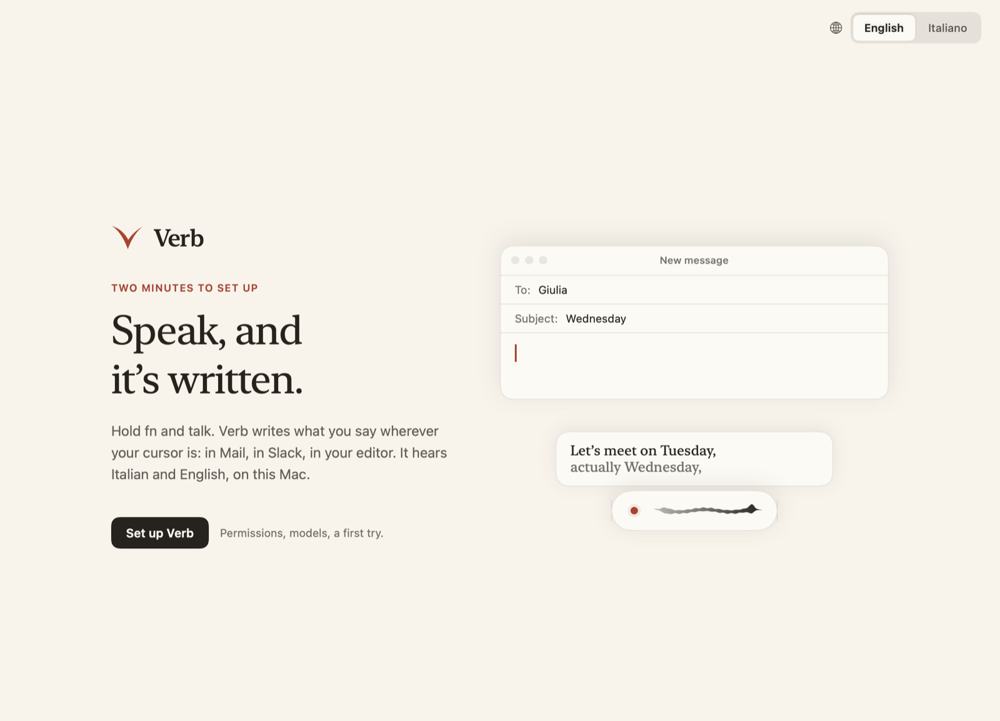
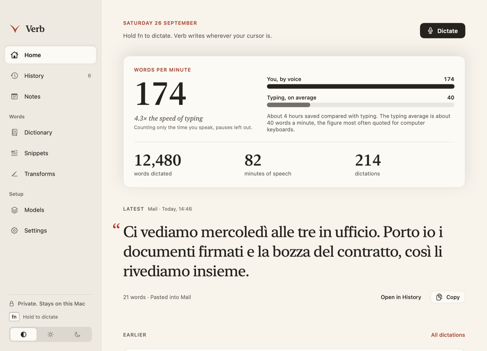
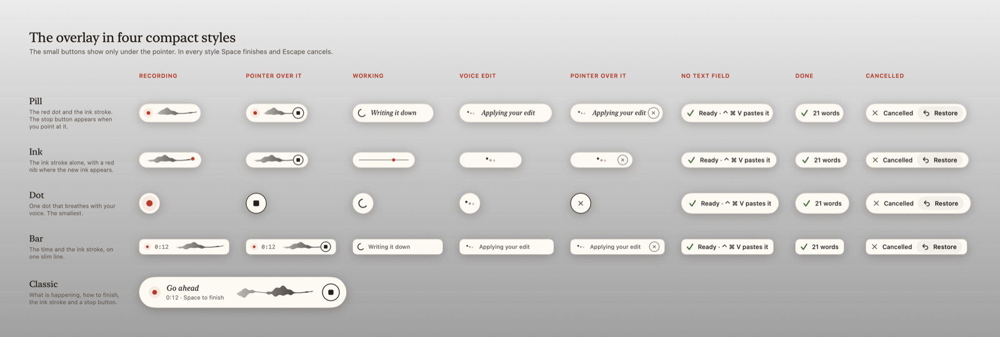
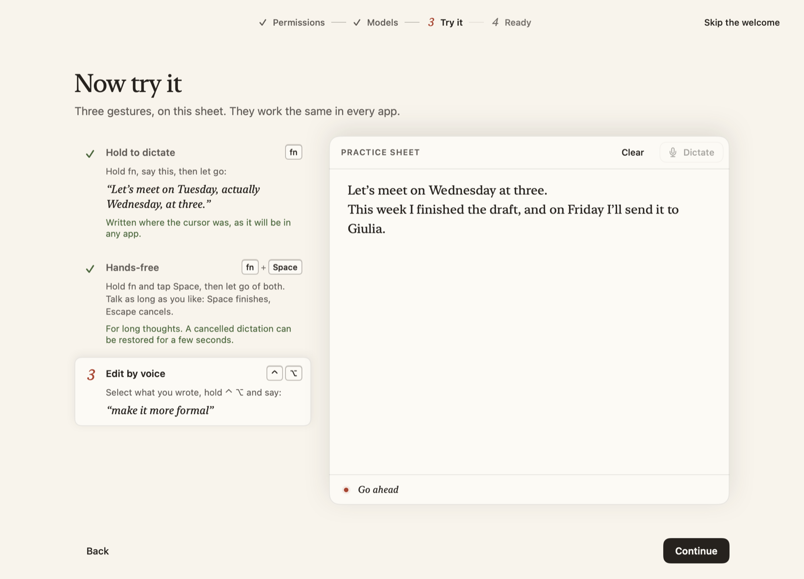
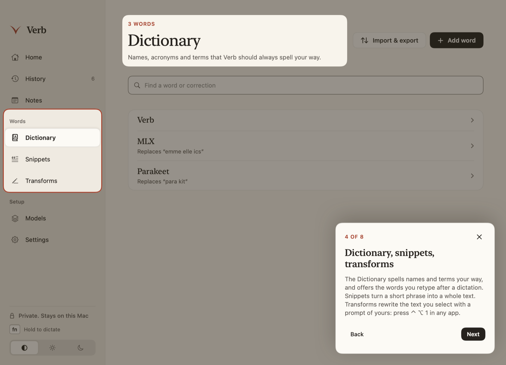

<p align="center">
  
</p>

<h1 align="center">Verb</h1>

<p align="center">
  <strong>Hold a key, speak, and your words appear wherever the cursor is.</strong><br>
  Native macOS dictation for Italian and English, running on your Mac.<br>
  MLX speech recognition, an optional local writing model, no account, no server, no telemetry.
</p>

<p align="center">
  <a href="https://github.com/MazzariniTommaso/verb/releases/latest/download/Verb.dmg"></a>
</p>

<p align="center">
  
  
  
  
  
</p>

<p align="center">
  <picture>
    <source media="(prefers-color-scheme: dark)" srcset="docs/images/welcome-dark.png">
    
  </picture>
</p>

---

**Verb** is a menu bar app. Hold **fn** in any app, talk, let go: the text is written where your cursor is, with fillers removed, your dictionary applied and the spacing fitted to the sentence around it. Say “Tuesday, actually Wednesday” and a writing model keeps only Wednesday.

Why it's worth a look if you write software:

- **Speech runs on the Mac.** [Parakeet v3](https://huggingface.co/nvidia/parakeet-tdt-0.6b-v3) or [Qwen3-ASR](https://huggingface.co/Qwen/Qwen3-ASR-0.6B) through [MLX Audio Swift](https://github.com/Blaizzy/mlx-audio-swift) on the Apple GPU. No Python, no server, no network after the download.
- **Fast by default.** Deterministic rules clean every dictation instantly. The language model steps in only when the words call for it: a spoken correction, a list, a long passage.
- **Bring your own model.** A private [Ollama](https://ollama.com) instance, any OpenAI-compatible endpoint, or the **Claude Code, Codex, Cursor, Gemini or Copilot CLI you're already signed in to**, run in a sandbox with every tool disabled.
- **Code by voice.** In editors and terminals Verb reads the open project: “user id” becomes `userId`, “app model dot swift” becomes `AppModel.swift`, and in a terminal “tag index dot ts” becomes `@src/index.ts` for Claude Code.
- **Nothing gets lost.** The raw transcript is saved before any rewriting, the clipboard is always given back, and a cancelled dictation can be restored for eight seconds.
- **Readable codebase.** A pure-Swift core and engine with 122 tests, native SwiftUI and AppKit, a snapshot renderer for every screen, and scripted UI checks.

## Contents

- [Quick start](#quick-start)
- [Features](#features)
- [How it works](#how-it-works)
- [Development](#development)
- [Models and providers](#models-and-providers)
- [Privacy and data](#privacy-and-data)
- [Keys](#keys)
- [Performance](#performance)
- [Contributing](#contributing)
- [License](#license)

## Quick start

**Download.** Get [Verb.dmg](https://github.com/MazzariniTommaso/verb/releases/latest/download/Verb.dmg), about 10 MB, for an Apple Silicon Mac with macOS 14 or later. Open it and drag Verb to Applications. The app isn't notarized, so macOS blocks its first launch: open System Settings → Privacy & Security and click **Open Anyway**, or run

```sh
xattr -dr com.apple.quarantine /Applications/Verb.app
```

**Build from source.** You need Xcode with Swift 6.2+ and the Metal Toolchain component. If `xcrun metal --version` fails, run `xcodebuild -downloadComponent MetalToolchain`.

```sh
git clone https://github.com/MazzariniTommaso/verb.git && cd verb
bash scripts/build.sh          # builds and signs release/Verb.app (ad hoc)
open release/Verb.app
```

On first launch Verb opens a short welcome:

1. It asks for **Microphone** and **Accessibility**. Accessibility lets fn start a dictation from any app and lets Verb type into the field in front.
2. It downloads the speech model: Parakeet v3, 2.51 GB, or Qwen3-ASR, 713 MB. Downloads use pinned revisions, resume after a dropped connection, and check every file's size and the weights' SHA-256.
3. It offers a **writing model**. This is optional, and dictation works without one.
4. It lets you try the three gestures on a practice sheet: hold, hands-free and voice edit.

Everything can be skipped. **Help → Take the Tour** walks through the window afterwards.

> [!NOTE]
> The build is ad-hoc signed and not notarized. macOS can ask for permissions again after a rebuild. If Accessibility is on but Verb says it's off, remove Verb from the list in System Settings and add the new build.

To bundle the speech weights into the app instead of downloading them, point `VERB_MODEL_SOURCE` at a model root's `MLX` folder:

```sh
VERB_MODEL_SOURCE=/path/to/models/MLX bash scripts/build.sh
```

Bundled weights survive later rebuilds. `VERB_BUILD_DIR` moves the build cache.

## Features

<p align="center">
  <picture>
    <source media="(prefers-color-scheme: dark)" srcset="docs/images/home-dark.png">
    
  </picture>
</p>

**Dictation**
- **Hold fn** to talk and let go to write. **fn + Space** switches to hands-free: Space finishes, Escape cancels. Every shortcut can be rebound; Space and Escape keep these roles.
- **Pressed while the last dictation is still being written**, the keys record nothing and the overlay says so. That dictation is pasted once you let go.
- **Voice start and stop.** Once you turn it on, “Hey Verb” or “Ehi Verb” starts a hands-free dictation. In any hands-free dictation, “Hey Verb stop”, “Ehi Verb invia” or “Hey Verb send” finishes it, and “Ehi Verb annulla” throws it away; a dictation held with the key ends when you let go. You can add your own names and command words.
- **Live preview.** A card above the overlay shows the words as they form.
- **Up to 4 hours per dictation** on the Mac. The audio is read in five-minute windows, and progress is checkpointed every minute.
- The **overlay** comes in five styles: Pill, Ink, Dot, Bar and Classic. It is non-activating, so it never takes focus.
- **Music and video are turned down** while you speak.
- With the system microphone selected, Verb uses the **Mac's own microphone** instead of Bluetooth headphones, which would drop to call quality.
- **Restore** brings a cancelled dictation back for eight seconds. Quitting Verb mid-dictation keeps the recording in History, ready to retry.
- **Import audio**: drop an m4a, mp3, wav or aiff file on History to transcribe it.

**Writing**
- **Instant rules** on every dictation except in the Verbatim style: hesitations (“ehm”), stumbled repeats and spacing. Words that carry meaning (“no no”, “molto molto”, “that that”) are kept.
- **Line breaks by voice.** “New line” or “a capo” starts a new line, “new paragraph” or “nuovo paragrafo” a new paragraph, when said as a command. Inside a sentence they stay words: “Marco è a capo del progetto”.
- **Writing model policy**: Always, When needed (the default) or Never. **A guard** rejects any clean-up that changes a number, a date, a name, a dictionary word or a negation, or that answers instead of transcribing. A spoken correction (“anzi”, “actually”) lets only its own sentence change. When the guard rejects a clean-up, Verb pastes your words as you said them.
- **Styles**: Natural, Casual, Formal and Verbatim, with one style per app (Messages casual, Mail formal, Terminal verbatim).
- **Fits the field.** Verb reads a little of the text around the cursor to set a space before the dictation, a lowercase letter mid-sentence and no full stop mid-phrase. Chromium and Electron apps are asked to expose their text. Apps that expose none get Verb's memory of its own last paste and of your last typed characters.
- **Dictionary** with preferred spellings and “heard as” corrections. It learns: retype a word after a dictation and Verb offers to add it. Nothing is added without your confirmation, and the words waiting for it stay in memory.
- **Names from the field.** Names and identifiers already on screen become recognition hints, and a misspelling of one is put right. A real name you say, or a different number, is never swapped for one on screen.
- **English inside Italian.** English words the engine wrote the Italian way (“mercio” for merge) are put back. Names and places are left alone.
- **Snippets**: a short phrase expands to a whole text, optionally Markdown pasted as rich text. Variables include `{date}`, `{time}`, `{weekday}`, `{clipboard}` and `{cursor}`, or `{data}`, `{ora}`, `{giorno}`, `{appunti}` and `{cursore}` in Italian.

**Editing**
- **Voice edit.** Select text, hold **⌃⌥** and say “make it shorter” or “traduci in inglese”. It works in editors that hide their selection from Accessibility.
- **Transforms** are saved prompts on **⌃⌥1–9**, with any number of extra ones in the menu bar.

**Notes and meetings**
- **Notepad** on **⌃⌥N**, floating over every app. You dictate into it like any field. Notes are Markdown files, in any folder you choose, including iCloud Drive or an Obsidian vault.
- **Meeting notes** record your microphone and what the Mac plays, through a Core Audio process tap (macOS 14.2+). No bot joins the call, and the recordings and the transcript stay on the Mac. The result is a transcript with You and Others, in the language spoken, then a summary from your writing model: In short, Decisions, Next steps and My to-dos. The summary is only sent out if that model is remote and remote processing is allowed when it's written. A meeting cut short by a quit is written down at the next launch, and its recordings expire like the others.

**App**
- **History** with search, original and final text, playback, retry and export. **Home** shows your words per minute counted on voiced time only, your streaks, a 15-week heatmap and your top apps.
- **Memory control.** The models unload after 30 minutes idle (configurable), and live RAM and CPU are shown.
- **English or Italian interface**, and Light, Dark or Automatic appearance, all switchable live. VoiceOver labels, Reduce Motion, 44 pt hit areas for buttons, and every page usable at the smallest window, 900 × 680.

<p align="center"></p>

## How it works

```
fn held ──▶ Hotkeys (CGEventTap; Carbon hot keys for combos)
              │
              ▼
          Recorder (AVAudioEngine → 16 kHz mono) ──▶ VoiceActivity (utterances, "Ehi Verb")
              │
              ▼
          LocalSpeech (MLX: Parakeet v3 / Qwen3-ASR)     raw transcript saved to History first
              │
              ▼
          TextRules · dictionary · snippets · CodeSpeech · EnglishTerms · FieldTerms
              │                                          writing model only when needed
              ▼
          ModelClient (Ollama :11435 / endpoint) · HarnessClient (CLI subscriptions)
              │                                          CleanupGuard: meaning kept or rewrite dropped
              ▼
          FieldFormatting (text around the cursor) ──▶ TextInserter (lazy pasteboard + ⌘V, clipboard restored)
```

The package has five targets: four in Swift, and `CSQLite`, which links the system SQLite. The app and `verb-check` depend on `VerbCore` and `VerbEngine`.

| Target | What lives there |
|---|---|
| `VerbCore` | Pure Swift, no UI and no audio. Settings and records, text rules, voice commands and voice activity, field formatting, cleanup guard, code speech, snippets, notes, SQLite storage, provider policy. Almost every test targets this. |
| `VerbEngine` | Model runtimes and child processes: MLX speech loading and download, chunked PCM reading, the HTTP client for Ollama and endpoints, and the sandboxed CLI bridge for subscriptions. |
| `Verb` | The app: SwiftUI and AppKit UI, menu bar, overlay, hotkeys, text insertion, recorder, meeting recorder, onboarding and tour, snapshot renderer, diagnostics. |
| `VerbCheck` | `verb-check`, a command-line tool that runs the engines without the app. |
| `CSQLite` | The module map for the SQLite that macOS supplies. |

Start reading here:

| File | Why |
|---|---|
| `Sources/Verb/AppModel.swift` | The state machine: authorize, record, transcribe, polish, insert. It also owns settings, history and the voice-activation loop. |
| `Sources/Verb/Hotkeys.swift` | Modifier-only bindings (fn, ⌃⌥), Space to go hands-free, Escape. |
| `Sources/Verb/TextInsertion.swift` | Capturing the target field, the Accessibility checks, the lazy pasteboard, clipboard restore. |
| `Sources/VerbCore/TextRules.swift` | Fillers, repeats, dictionary corrections, snippet protection. |
| `Sources/VerbCore/FieldText.swift` | Fitting to the field, and the correction learner. |
| `Sources/VerbCore/VoiceCommands.swift` | Wake and stop phrases, matched against the spellings the engine actually writes. |
| `Sources/VerbEngine/HarnessClient.swift` | Claude Code, Codex, Cursor, Gemini and Copilot adapters. |
| `Sources/Verb/Theme.swift` | The UI components. Every value comes from the generated `DesignTokens.swift`. |

## Development

```sh
bash scripts/build.sh                    # release/Verb.app, signed ad hoc
swift test                               # 122 tests: VerbCoreTests and VerbEngineTests
swift build -c release --product verb-check
bash scripts/package.sh                  # release/Verb.dmg to share, about 10 MB
```

`scripts/build.sh` refuses to run while Verb is open, because macOS kills an app whose binary changes underneath it. Quit it first:

```sh
osascript -e 'tell application id "app.verb.dictation" to quit'
```

**Share a build.** `scripts/package.sh` packs `release/Verb.app` into a disk image with a link to Applications. It leaves the speech weights out, so the welcome downloads the model on the other Mac. That Mac needs Apple Silicon and macOS 14 or later. The app isn't notarized, so macOS blocks its first launch: allow it in System Settings → Privacy & Security → **Open Anyway**, or run `xattr -dr com.apple.quarantine /Applications/Verb.app`.

**See every screen without clicking.** The app binary renders every page, sheet and overlay state in both languages and both appearances, from a throwaway profile. It never starts the microphone, a hotkey or a model:

```sh
.build/release/Verb --render-snapshots /tmp/verb-renders                         # everything, including every page at 900 × 680
.build/release/Verb --render-snapshots /tmp/verb-renders --only welcome,tour     # by name prefix, about 1 minute
```

**Diagnostics and scripted checks.** These run from the app executable, `.build/release/Verb` or `release/Verb.app/Contents/MacOS/Verb`. The two that use Accessibility need the app itself, so macOS asks on its behalf rather than the terminal's; each flag stops if its path is missing:

| Flag | Does |
|---|---|
| `--check-welcome FILE` | Walks the welcome and the tour in an off-screen window: practice sheet focus, gesture ticks, every tour target, persistence. |
| `--check-notepad FILE` | Checks the floating notepad's window behaviour. Run it with `open -n -g release/Verb.app --args --check-notepad FILE`. |
| `--measure-frames FILE` | Measures how often the overlay's ink stroke is redrawn. Unlock the screen first. |
| `--probe-fields FILE [--wake]` | Reports what each open app exposes to Accessibility about its focused field. It records flags and sizes, never text. Run it with `open -n -g release/Verb.app --args --probe-fields FILE`. |
| `--data-dir PATH` | Uses an isolated profile instead of `~/Library/Application Support/Verb`, with its own Keychain entries. |
| `--background` | Starts in the menu bar, as a login item does. |
| `--welcome` | Opens the welcome at launch. |

**Engines without the app.** `MODEL_ROOT` holds an `MLX` folder with one folder per model, just as `Contents/Resources/MLXModels` does inside the app.

```sh
.build/release/verb-check install MODEL_ROOT parakeet-v3
.build/release/verb-check transcribe MODEL_ROOT Tests/Fixtures/italian.aiff auto parakeet-v3
.build/release/verb-check transcribe MODEL_ROOT Tests/Fixtures/english.aiff auto parakeet-v3
.build/release/verb-check listen MODEL_ROOT /tmp/wake.aiff          # wake and stop phrases, the app's own path
.build/release/verb-check cleanup 'Ci vediamo martedì, anzi mercoledì.'   # needs Verb's Ollama running
.build/release/verb-check evaluate-cleanup                          # the clean-up cases against the local writing model
.build/release/verb-check harness-list claude                      # model catalog only
.build/release/verb-check harness-edit claude haiku "Ehm, il gatto è sul divano, anzi sulla sedia."   # uses plan quota
python3 Tests/Fixtures/provider_fixture.py &                       # a fake endpoint on :11436
.build/release/verb-check verify-endpoint http://127.0.0.1:11436 Tests/Fixtures/italian.aiff
```

To make a wake-phrase recording: `say -v Alice -o /tmp/wake.aiff "Ehi Verb. [[slnc 1000]] Ci vediamo alle tre. [[slnc 1000]] Ehi Verb stop."`

**Design tokens.** Colours, type, spacing, radii and motion live in `Design/tokens.json`. Regenerate after editing it:

```sh
python3 scripts/generate-tokens.py      # writes Sources/Verb/DesignTokens.swift and Design/tokens.css, checks WCAG contrast
swift scripts/make-icon.swift /tmp/Verb.iconset && iconutil -c icns /tmp/Verb.iconset -o Resources/Verb.icns
```

**Two languages, side by side.** Every UI string is written as `t("English", "Italiano")` at the call site. Messages coming from `VerbCore` and `VerbEngine` stay in English and are translated in `Sources/Verb/Italian.swift`.

Read [CONTRIBUTING.md](CONTRIBUTING.md) before opening a pull request. Coding agents should read [AGENTS.md](AGENTS.md).

<p align="center"></p>

## Models and providers

**Speech recognition** runs on the Mac by default:

| Model | ID | Download | Notes |
|---|---|---|---|
| [Parakeet v3](https://huggingface.co/mlx-community/parakeet-tdt-0.6b-v3) | `parakeet-v3` | 2.51 GB | Default. Multilingual, with automatic language detection. |
| [Qwen3-ASR 0.6B 4-bit](https://huggingface.co/mlx-community/Qwen3-ASR-0.6B-4bit) | `qwen3-asr-0.6b-4bit` | 713 MB | Compact. Takes language and vocabulary hints. |

Audio is downmixed to 16 kHz and cut into segments of at most 28 s near quiet points. A hosted speech endpoint also works: multipart `file`, `model`, `language` and `prompt` in, JSON `text` out. It is limited to 20 minutes per dictation; recordings over 10 MB, or in a format the service may refuse, are converted to m4a first.

**Writing and cleanup** is optional:

| Provider | How |
|---|---|
| On this Mac | Verb starts the installed Ollama on `127.0.0.1:11435` with `OLLAMA_NO_CLOUD=1` and its own model folder. It never touches your normal Ollama on 11434. The default model is `qwen3:4b-instruct-2507-q4_K_M`, 2.5 GB. `qwen3:1.7b` is quicker. |
| My subscriptions | The Claude Code, Codex, Cursor Agent, Gemini or GitHub Copilot CLI, with the login you already have. See below. |
| Hosted or custom server | Any Chat Completions endpoint, OpenAI's reasoning models included. Loopback HTTP is allowed; a `-cloud` model on a loopback Ollama runs remotely, so it needs **Allow remote processing**, like anything that isn't loopback, which also requires HTTPS. |
| None | Rules, dictionary and snippets only. Voice edits and transforms need a model. |

**Subscriptions, safely.** Verb launches the CLI directly, with no shell, and passes the text over stdin, the protocol or a private file, never in `argv`:

- Each call runs in a temporary directory, with an allowlisted environment, a deadline and bounded output. A cancel or a timeout stops the CLI and anything it started.
- Reading your account and the model list reaches the provider too, so it also waits for **Allow remote processing**.
- Tools, MCP, hooks, web access and file access are disabled or denied for every provider.
- API-key environment variables and endpoint overrides are stripped, and API-key logins are refused. Claude and Codex must use a subscription login, Gemini Google OAuth, and Cursor a non-API login.
- Verb never reads OAuth tokens. Each CLI authenticates itself. Model catalogs come from the CLI, never from a hardcoded list.
- Remote processing is off in a fresh profile. There's no fallback to another provider or to API billing. A failed clean-up keeps the original transcript.

These calls count against your plan's limits.

| Provider | Log in | Catalog |
|---|---|---|
| Claude Code | `claude auth login` | CLI initialize response |
| Codex | `codex login` (ChatGPT) | app-server `model/list` |
| Cursor Agent | `agent login` | `agent --list-models` |
| Gemini CLI | `gemini` (Google login) | ACP session models |
| GitHub Copilot | `copilot login` | headless `models.list` |

## Privacy and data

- **Nothing leaves the Mac** unless you choose a remote provider and turn on **Allow remote processing**. What is sent is then exactly what that stage needs: audio to speech, text and vocabulary to writing, and the selection for an explicit edit.
- **No analytics, no account, no screenshots.** API keys go to the Keychain, never to `settings.json`.
- **What Verb reads.** When a dictation starts, Verb reads the text around the cursor and the window title: up to 3,000 characters before and 800 after for name hints, 400 and 80 for spacing. Nothing is kept beyond that dictation, and both can be turned off in Settings → Dictation. Words you retype after a dictation wait as suggestions in memory; one you turn down is remembered only as a digest. It reads the selection only for a voice edit or a transform. Where an app exposes no text, it remembers the last characters you typed there, at most 40 and in memory only, until a click, an arrow key, a shortcut or an app switch. Password fields hide their keys from every app.
- **“Hey Verb”**, when you turn it on, keeps the last 12 seconds of audio in memory and checks each utterance on the Mac. Nothing is written or sent until it hears the phrase. The orange microphone light stays on while it listens.
- **The clipboard stays yours.** The text is handed to the target app only when it asks. What you had copied is back 250 ms after the read, or after 1.5 s if the app never reads. Clipboard managers are told the pasted item is transient.

Everything lives in `~/Library/Application Support/Verb/`. The folder, and every recording and note in it, is readable by your user only:

| Path | Contents |
|---|---|
| `history.sqlite` | Dictation history and recovery journal. It keeps 30 days by default, adjustable from 24 hours to forever, or not kept at all. |
| `Audio/` | Recordings for playback and retry. They expire after 14 days, or sooner under the history setting. With audio off, only a dictation that failed keeps its recording, for Retry. |
| `settings.json` · `library.json` · `stats.json` | Preferences · dictionary, snippets and transforms · totals |
| `Notes/` · `Meetings/` | Markdown notes · meeting recordings, which expire like the others and are kept only if you keep audio |
| `Models/MLX/` · `WriterModels/` | Downloaded speech weights · Verb's own Ollama models |
| `harness-catalogs.json` | Cached CLI model catalogs. It holds no tokens and no email. |
| `writer.pid` | The process number of Verb's own Ollama, so one left by a crash is stopped. |
| `*.unreadable` | A settings or library file with a value Verb couldn't read, kept as it was; the rest was loaded. |

## Keys

| Action | Default |
|---|---|
| Dictate | hold **fn** |
| Go hands-free | **Space** while holding fn, then **Space** to finish and **Escape** to cancel |
| Edit the selection by voice | hold **⌃⌥**, then speak |
| Run a transform on the selection | **⌃⌥1** … **⌃⌥9** |
| Paste the last dictation | **⌃⌘V** |
| Copy the last dictation | **⇧⌘C** |
| Open or close the notepad | **⌃⌥N** |
| Start or stop by voice | “Ehi Verb” … “Ehi Verb stop” (Settings → Voice) |

You can rebind every shortcut in Settings → Keyboard, and each transform on the Transforms page; Space and Escape keep their roles, and Space can't be part of the keys you hold. If fn opens the emoji picker or macOS Dictation, pick other keys or change the fn action in System Settings → Keyboard. Some external keyboards don't send fn at all.

<p align="center"></p>

## Performance

These were measured on an M4 MacBook Pro running macOS 27.

- **Speech:** a 9 min 43 s recording was transcribed in 7.6 s with Parakeet v3.
- **Writing model**, Qwen3 4B loaded: 0.4 s for 7 words, 1.5 s for 30 words, 2.4 s for 46 words, and about 4 s on a cold load. The same edits through the Claude CLI took 6 to 31 s.
- **Wake phrase,** tested through `verb-check listen` with the macOS voices:
  - 17 of 20 “Ehi Verb” phrases started a dictation;
  - 15 of 17 endings stopped it;
  - 16 of 17 final texts came out without the commands;
  - none of 26 near-miss sentences (“A verb describes an action”, “Ehi, verbale approvato?”) woke it.

Numbers from other Macs are very welcome. Open an issue with yours.

## Contributing

Pull requests are welcome, whether they fix a bug, tune a heuristic, add a test or polish the UI. Some places where help goes a long way:

- **Apps where insertion or field fitting misbehaves.** Attach the `--probe-fields` output, which contains no text.
- **Spellings the engine writes** for your “Ehi Verb”, and the tests that go with them in `VoiceTests.swift`.
- **Rules and guards** in `VerbCore`, which are pure functions with fast tests.
- **Measurements** on M1, M2 and M3 Macs, and on older macOS versions.

Start with [CONTRIBUTING.md](CONTRIBUTING.md). It covers setup, conventions, the checks to run and the invariants no change may break.

## License

The code is released under the [MIT License](LICENSE).

The speech weights and third-party packages keep their own licenses. Parakeet v3 is CC BY 4.0, Qwen3-ASR is Apache 2.0, and MLX, MLX Audio Swift and the Swift packages are MIT or Apache 2.0. They are listed in [`Resources/Licenses`](Resources/Licenses), and that folder ships inside the app. See [`Resources/Licenses/MODELS.md`](Resources/Licenses/MODELS.md) for attribution.

Built on [MLX Swift](https://github.com/ml-explore/mlx-swift), [MLX Audio Swift](https://github.com/Blaizzy/mlx-audio-swift), NVIDIA's [Parakeet](https://huggingface.co/nvidia/parakeet-tdt-0.6b-v3), Qwen's [Qwen3-ASR](https://huggingface.co/Qwen/Qwen3-ASR-0.6B) and [Ollama](https://ollama.com).
